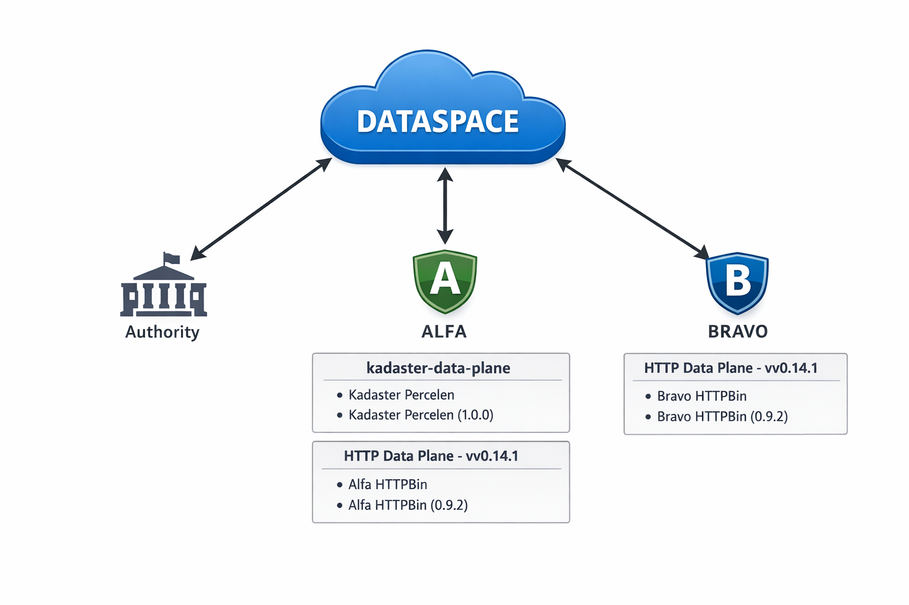
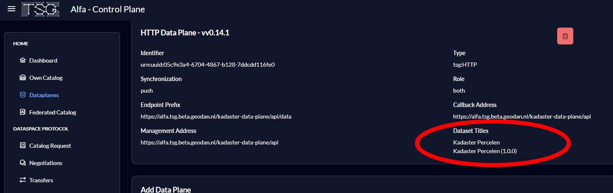
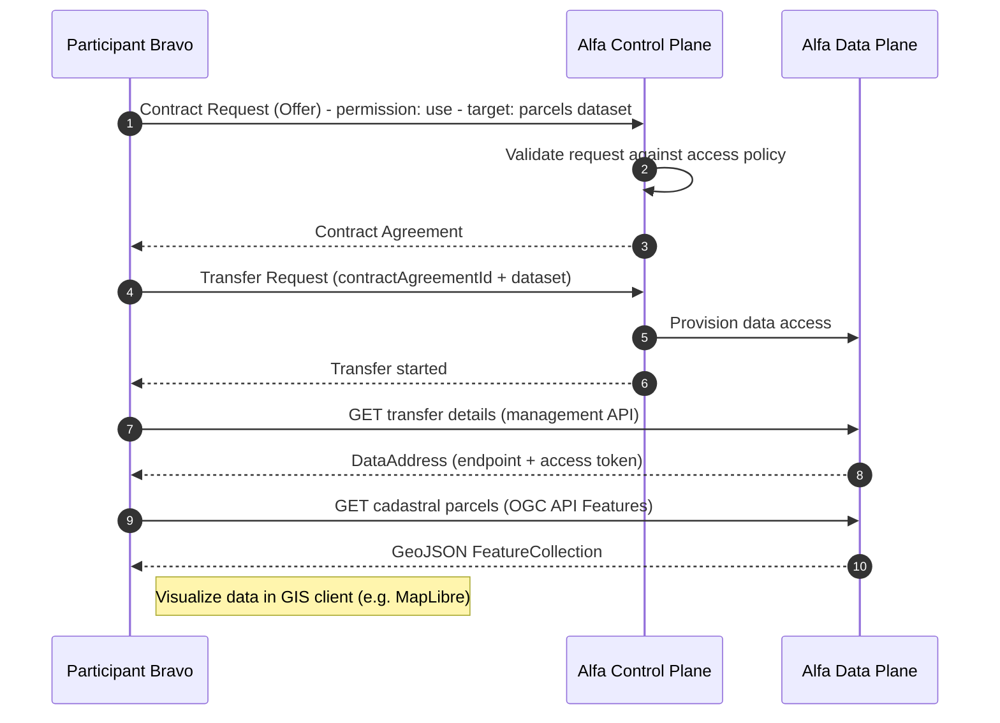
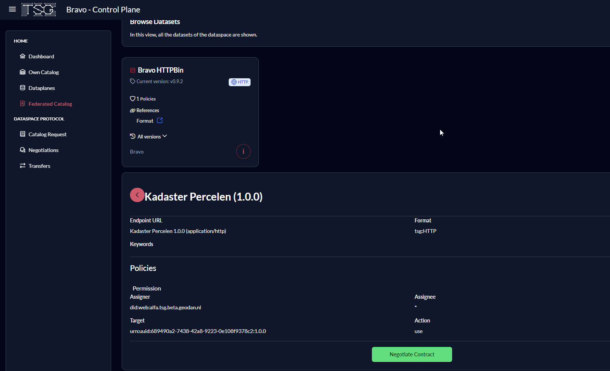
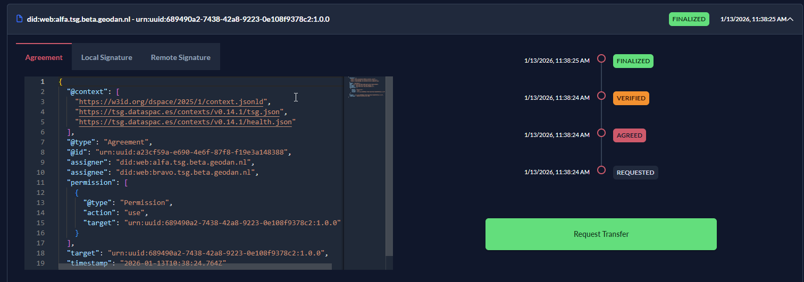
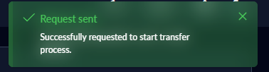
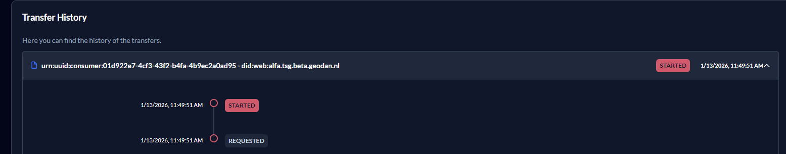
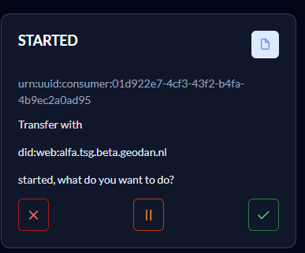
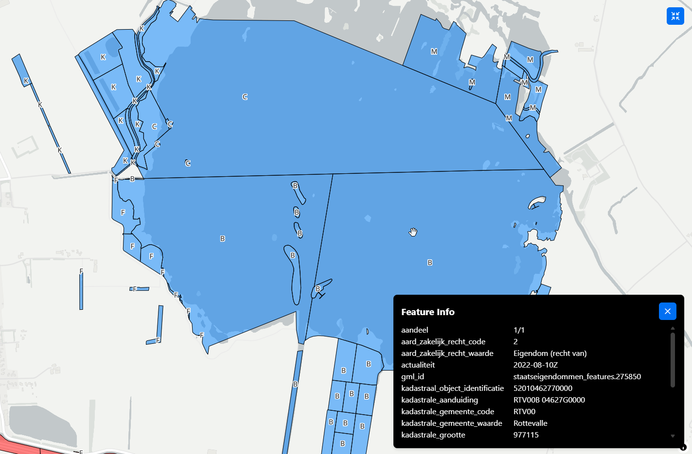

# Understanding Data Spaces: Architecture, Concepts, and Scenario Demonstration

## Introduction

Data Spaces enable secure, decentralized data sharing between organizations while preserving data sovereignty. They standardize how data is discovered, how access conditions are negotiated, and how data is exchanged under enforceable policies. The data space protocol is described at https://docs.internationaldataspaces.org/ids-knowledgebase/dataspace-protocol. 

This article outlines the core concepts and architecture of data spaces and demonstrates their practical operation using Data Space reference implementation 'TNO TSG Security Gateway' (https://tsg.dataspac.es/).

## Data Space Architecture

A data space uses a federated architecture where each participant operates its own systems and data remains with the provider. There is no central data storage; interoperability is achieved through shared protocols and governance rules.

Each participant implements two planes:

- Control Plane – manages discovery, identity, contract negotiation, and policy agreement using the IDS Dataspace Protocol.

- Data Plane – enables secure, contract-bound access to provider-hosted data.

Participants connect through a Security Gateway, such as the TNO TSG Security Gateway, which enforces contracts and policies during data access.

Each participant plays one or multiple roles in a Dataspace:

- **Data Provider**: Owns and shares data. Publishes metadata to enable discovery and defines access policies.

- **Data Consumer**: Searches for and requests access to data. Negotiates contracts with providers based on published policies.

## Scenario Demonstration

To illustrate how data spaces operate, consider a simplified scenario with two organizations: participant Alfa (role Data Provider) and participant Bravo (role Data Consumer).




### Data Publication

Alfa hosts a dataset and publishes metadata describing the dataset. As sample dataset, we use a collection of cadastral parcel data offered as OGC API Features service. 

Sample metadata configuration for Alfa's Cadastral parcels dataset in the Kadaster Data Plane:

```
  dataset:
    type: versioned
    title: Kadaster Percelen
    currentVersion: 1.0.0
    versions:
      - version: 1.0.0
        distributions:
          - backendUrl: http://gokoala:8080
    policy:
      type: default
```

The 'gokoala' service hosts the OGC API Features service with the cadastral parcel data. See https://github.com/PDOK/gokoala for more information about GoKoala.

In the Alfa Control Plane - HTTP Dataplane 'kadaster-data-plane', the published dataset appears as follows:




Now, participant Bravo can discover and request access to the cadastral parcel dataset hosted by Alfa. The sequence of operations is as follows:

Sequence of operations in the scenario:




### Data Discovery

Participant Bravo searches the data space for datasets of interest in the 'Federated Catalog'. The Federated Catalog aggregates metadata from all connected participants, enabling Bravo to discover datasets published by Alfa.



Participant Bravo has now the option to request access to the dataset using the 'Negotiate Contract' button.

### Contract Negotiation

Participant Bravo initiates contract negotiation by sending a contract request to Alfa's Control Plane. The request includes a use permission and the target dataset (parcels dataset). 

Simplified JSON request looks like:

```
{
  "@type": "Offer",
  "assigner": "did:web:alfa.tsg.beta.geodan.nl",
  "permission": [
    {
      "@type": "Permission",
      "action": "use",
      "target": "urn:uuid:689490a2-7438-42a8-9223-0e108f9378c2:1.0.0"
    }
  ]
}
```

Participant Alfa evaluates the request against the dataset's access policy. If the request complies with the policy, Alfa generates a contract agreement and sends it back to Bravo.

Participant Bravo receives the contract agreement and has the option to start the 'Transfer Process' using the button 'Request Transfer'.



### Data Transfer

Participant Bravo initiates the data transfer by sending a transfer request (using the 'Request Transfer button) to Alfa's Control Plane. The request includes the contract agreement ID and the target dataset. 



Participant Alfa validates the transfer request against the contract agreement. If valid, Alfa provisions access to the dataset in the Data Plane.

Participant Bravo can now access the dataset through the Data Plane using the provided access details.



Both Participants have the option to Terminate, Suspend, or Complete the data transfer using the respective buttons.



Participant Bravo can request the transfer details using HTTP GET request to the Data Plane API:

```GET /api
GET https://{{host}}/http-data-plane/api/management/transfers
Authorization: Bearer {{login.response.body.access_token}}
```

Response contains the data address with access details:

```json
"dataAddress": {
  "@type": "DataAddress",
  "endpointType": "tsg:HTTP",
  "endpoint": "https://alfa_participant/kadaster-data-plane/api/proxy/8ccf88bd-90ed-4838-bddb-89cdfdbaf5bd",
  "endpointProperties": [
    {
      "@type": "EndpointProperty",
      "name": "Authorization",
      "value": "Bearer {{transfer_access_token_value}}"
    }
  ]
}
```

Using the provided endpoint and authorization token, Bravo can now access the cadastral parcel data hosted by Alfa.

Sample request to access the OGC API Features service:

```GET /cadastral-parcels
GET https://alfa_participant/kadaster-data-plane/api/proxy/8ccf88bd-90ed-4838-bddb-89cdfdbaf5bd/collections/features/items?bbox=5.985804505598338,53.11870504833723,6.0861719160283485,53.16076560750932&limit=100&crs=http://www.opengis.net/def/crs/OGC/1.3/CRS84&bbox-crs=http://www.opengis.net/def/crs/OGC/1.3/CRS84
Authorization: Bearer {{transfer_access_token_value}}
```

Response contains the requested cadastral parcel data as GeoJSON Feature Collection:

```json
{
  "type": "FeatureCollection",
  "features": [
    {
      "type": "Feature",
      "id": "NL.IMKAD.Percelen.123456789",
      "geometry": {
        "type": "Polygon",
        "coordinates": [[[6.0001, 53.1201], [6.0002, 53.1202], [6.0003, 53.1203], [6.0001, 53.1201]]]
      },
      "properties": {
        "kadastrale_aanduiding": "RTV00B 04627G0000",
        "kadastrale_grootte": 977115,
        ... other properties ...   }
    }
  ]
}
```

The feature collection contains cadastral parcel data with geometries and properties. We can now visualize this data in a GIS client applicatiion, such as MapLibre:



## Conclusion

This article demonstrated the core concepts and architecture of data spaces using the TNO TSG Security Gateway reference implementation. We illustrated how data providers can publish datasets, how data consumers can discover and   request access, and how secure data transfer occurs under enforceable contracts.
